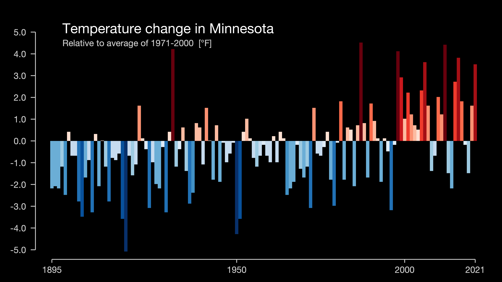
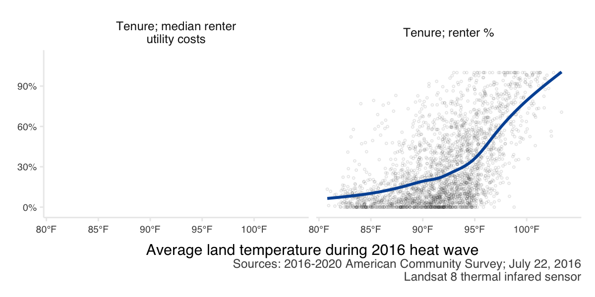

```{r include = F}
library(tidyverse)
library(lubridate)
library(councilR)
library(tidycensus)

knitr::opts_chunk$set(
  echo = F, message = F, warning = F, results = "hide",
  fig.pos = "H"
  # ,fig.height = 4
  , dpi = 300
)

`%not_in%` <- Negate(`%in%`)

```

# Action items

1) COW meeting: big question is "with the Council's convening ability, could we pull together some shared definitions, consider developing a stakeholder group to guide this work? 
2) LUAC meeting: big question is "what tools/data would help you commit to and act on mitigating extreme heat? Thinking about resource allocations, planning decisions, etc.
3) Council Climate Workgroup: they are focusing on Climate Action Plan right now, may not be best fit

# Introduction

The Metropolitan Council provides local planning assistance for communities across the Twin Cities region. As part of this assistance, the Council provides an “Extreme Heat Mapping Tool” for the Twin Cities. This tool shows the land surface temperature during the historic July 2016 heat wave and was created from remote-sensing data (Landsat 8). This dataset has proved particularly valuable as communities evaluate and plan for climate change adaptation techniques, future development and land use planning, and also undertake immediate interventions to reduce heat-related health consequences. 

Something about connections between heat and urban planning. 

The goal of this project is to do a major addition to the existing body of work. We hope to better integrate the consequences of climate change into city planning and policy decisions, give stakeholders tools to act on mitigating the risk of extreme heat, and ultimately help inform a more sustainable and healthier future for the Twin Cities region.  


# Changing *RISK* of extreme heat

## Historic temperature trends

Minnesota's temperatures have been warming over the past century, with warming trends accelerating since 2000 (Figure \@ref(fig:mn-warmingstripes-avg)). Warmer winters and rising daily low temperatures strongly contribute to this trend. 

```{r, mn-warmingstripes-avg}
#| fig.cap = "Average temperatures in Minnesota from 1895-2021. Source NOAA and https://showyourstripes.info.",
#| results='markup', 
#| out.width= "5in",  
#| out.extra='style="float:right"', 
#| fig.align='right'


```

Hotter summer temperatures are also a component of a warming world, and heat waves have direct consequences on human health. In Minnesota, warming summer trends (probably) include (Figure \@ref(fig:msp-temps):

- neither annual maximum temperatures nor average summer highs have changed much, but
- heat waves (multiple days of extreme heat) are more common
- daily minimum temperatures are warmer


```{r, msp-temps, fig.asp = 1, out.width= "6in", fig.cap = "Summer air temperatures (May 1 - Oct 1) at MSP airport since records began at that station. The shaded box shows the years which overlap with Landsat satellite data availability. The horizontal red dashed line shows 100 degrees F, and the vertical grey dashed line indicates year 2016 which is currently used to quanify the risk of extreme heat across the Twin Cities region."}
load("./data/msp_temps.rda")

landsat_yrs <- tibble(datatype = c("TMAX", "TMIN"),
                      lsy = c(88, 70), 
                      lsyend = c(106, 90))

msp_temps %>% filter(datatype %in% c("TMAX", "TMIN")) %>%
  mutate(plot = if_else(datatype == "TMAX", max, mean)) %>%
  bind_rows(msp_temps %>% filter(datatype == "TMAX") %>%
              mutate(plot = mean,
                     datatype = "TMAXmean")) %>%
  filter(year != 2022) %>%
  ggplot(aes(x = year, y = plot)) + #, col = doy
  geom_hline(data = data.frame(datatype = "TMAX"), aes(yintercept = 100), lty = 2, col = "red") +
  geom_vline(xintercept = 2016, lty = 2, col = "grey50") +
  # geom_rect(data = data.frame(datatype = "TMAX"), aes(xmin = 1983, xmax = 2022, ymin = -Inf, ymax = Inf), alpha = 0.1, fill="grey", inherit.aes = FALSE) +
  # geom_rect(data = data.frame(datatype = "TMIN"), aes(xmin = 1983, xmax = 2022, ymin = -Inf, ymax = Inf), alpha = 0.1, fill="grey", inherit.aes = FALSE) +
  annotate("rect", xmin = 1983, xmax = 2022, ymin = -Inf, ymax = Inf, alpha = .1) +
  geom_line(col = "grey 50") +
  geom_point() +
  councilR::theme_council_open() +
  labs(y = "", #str_wrap("Air temperature", 10),
       x = "", 
       title = "MSP airport air temperature") +
  scale_x_continuous(expand = c(.01,0)) +
  scale_colour_gradient(
    low = "#132B43",
    high = "#56B1F7",
    space = "Lab",
    # guide = "legend",
    aesthetics = "colour",
    breaks=c(lubridate::yday(ymd("2022-06-01")), 
             lubridate::yday(ymd("2022-07-01")),
             lubridate::yday(ymd("2022-08-01")),
             lubridate::yday(ymd("2022-09-01"))),
    labels=c("June 1",
             "July 1",
             "Aug 1",
             "Sept 1"),
    name = "Date"
  ) +
  annotate("text", label = "2016", x = 2016, y = -Inf, vjust = -1) +
  annotate("text", label = "Landsat era", x = 2005, y = Inf, vjust = 1) +
  facet_wrap(~datatype, ncol = 1, scales = "free_y",
             labeller = as_labeller(c(TMAX = "Hottest summer temperature recorded", 
                                      TMIN = "Average summer lows",
                                      TMAXmean = "Average summer highs"))) +
  scale_y_continuous(labels = function(x) paste0(x, "°F"))

#may - sept
```


## Extreme heat map


### Methods

Landsat satellite introduction. Various missions, sensor details, etc. 

Issues with Landsat include clouds (water vapor between the satellite and the ground make the pixels seem much cooler, so we can't rely on data with clouds), smoke cover, etc. 

Details on how often we get pictures of our area. Landsats 8/9 circle earth every 16 days. The entirety of our region is covered by path 27, row 28-29. The east metro is also on path 26, and the west metro is also on path 28. This means that extreme heat events don't always line up with when we get satellite data. 

GEE processing details. 

<!-- Path 27 is on Landsat 9 cycle day 3; Landsat 8 cycle day 11. https://landsat.usgs.gov/landsat_acq#convertPathRow -->
<!-- The east metro is path 26, it's on cycle day L9 = 12, L8 = 4 -->
<!-- West metro is path 28, L9 = 10, L8 = 2 -->

During the summer months, LandSat land surface temperatures and air temperatures line up pretty well at the airport (Figure \@ref(fig:temp-corr)). 

```{r temp-corr}
#| fig.cap = "Average temperatures in Minnesota from 1895-2021. Source NOAA and https://showyourstripes.info.",
#| results='markup', 
#| out.width= "5in",  
#| out.extra='style="float:right"', 
#| fig.align='right'
load("./data/msp_daily.rda")
gee <-
read_csv("./data/GEE_MSP_HeatHistory.csv",
         col_types = c("system:time_start" = "c",
                       "LST_L8" = "d",
                       "LST_L9" = "d")) %>%
  # pivot_longer(names_to = "source", values_to = "temp", -`system:time_start`) %>%
  # filter(!is.na(temp)) %>%
  # mutate(temp = (temp - 273.15) * (9/5) + (32)) %>%
  mutate(date = as.Date(`system:time_start`, format = "%b %d, %Y")) %>%
  mutate(across(where(is.numeric), ~ (.x - 273.15) * (9/5) + (32))) %>%
  select(-`system:time_start`) %>% 

  left_join(msp_daily %>%
              filter(datatype == "TMAX") %>%
              select(date, value) %>%
              rename("air_temp" = value)) %>%
  pivot_longer(names_to = "source", values_to = "temp", -c(date, air_temp)) %>%
  filter(!is.na(temp)) %>%
  mutate(doy = yday(date)) %>%
  mutate(flag = if_else(source == "LST_L7" & date > ymd("2003-06-01"), 9, 1)) %>% #remove when scan line errors started
  filter(flag == 1)

# gee %>%
#   filter(doy > yday(ymd("2020-05-01")),
#          doy < yday(ymd("2020-10-01"))) %>%
#   mutate(diff= temp - air_temp) %>%
#   ggplot(aes(x = date,  col = source)) +
#   geom_point(aes(y = diff)) +
#   # geom_point(aes(y = temp)) +
#   # geom_point(aes(y = air_temp),col = "black") +
#   geom_hline(yintercept = 0) +
#   theme_council_open() +
#   geom_vline(xintercept = ymd("2016-07-26"))
# 
# 
# # The primary features on Landsat 7 include a panchromatic band with 15 meter spatial resolution, an onboard full aperture solar calibrator, five percent absolute radiometric calibration, and a thermal infrared channel with a four-fold improvement in spatial resolution over Thematic Mapper (TM). Since June 2003, the sensor has acquired and delivered data with data gaps caused by the Scan Line Corrector (SLC) failure


gee %>%
  filter(doy > yday(ymd("2020-05-01")),
         doy < yday(ymd("2020-10-01"))) %>%
  mutate(type = case_when(air_temp < 85 ~ "mild",
                          # air_temp < 90 ~ "moderate",
                          TRUE ~ "hot")) %>% #filter(source == "LST_L7")
  ggplot(aes(x = air_temp, y = temp, col = source)) +
  geom_point()+#aes(col = source)) +
  theme_council_open() +
  geom_smooth(method = "lm", fill = NA)+#, col = "black") +
  labs( x = "Airport air temperature",
        y = str_wrap("Airport land surface temperature", 10),
        col = "Landsat") +
  scale_color_brewer(palette =  "Paired") +
  facet_wrap(~source)+
  guides(col = "none")
  # facet_wrap(~type, scales = "free")

# ls4 --> 1982-08-22T14:19:55 - 1993-12-14T00:00:00 #somehow this seems redundant with ls 5, so remove. 
# ls5 --> 1984-04-19T13:56:39 - 2011-11-08T14:18:44


```

### Results

Let's discuss. It may not be the best idea to wait for the hottest heat wave in order to update the map (if that was the case, we should go back in time to 1980's). Instead, how can we start to think about shifting risk of extreme heat? Or how the area/s of the region at risk of extreme heat grow/shrink/move over time?

Ideally, it would be great to just pick a summer day with low cloud cover, and look at the spatial patterns (do this for each year! back to 2013 would be easy "a decade of change", but we could go further back too). Would we want to look at ... difference (standard deviations?) from the regional mean temperature? Would it be a (communications/planning) problem that some areas are "colder" than the regional mean? 

I am not totally sure how we will want to do this, other ideas would be super helpful!


```{r heatmap, fig.align = 'center', out.width = "70%", fig.cap = "Example heat map summer 2022", results='markup', include = F, eval = F}
knitr::include_graphics(("./heatmap.png"))
```


```{r warmstripes, include = F, eval = F}
#| fig.cap = "Idea to show past trends",
#| results='markup', 
#| out.width= "3in",  
#| out.extra='style="float:right"', 
#| fig.align='right'
knitr::include_graphics(("./warmingstripes.png"))
```


```{r, fig.asp = .4, fig.cap = "Example trends showing a growing risk from extreme heat", include = F, eval = F}
mtcars %>%
  mutate(mpg = mpg * (-1),
         qsec = qsec * (-1),
         qsec3 = qsec,
         qsec2 = qsec) %>%
  pivot_longer(names_to = "names", values_to = "values", -mpg) %>%
  filter(names %in% c("qsec2", "qsec3")) %>%
  ggplot(aes(x = mpg, y = values)) + 
  facet_wrap(~names, scales = "free") +
  geom_point(alpha = .5) +
  geom_smooth(fill = NA, color = colors$councilBlue, method = "lm") +
  facet_wrap(~names,
          scales = "free", 
          nrow = 1, 
          strip.position = "left",
          labeller = as_labeller(c(qsec = str_wrap("Maximum summer temperature", 10), 
                                   qsec2 = str_wrap("Prolonged heat wave events (5 days or more w/ temps >90F)", 10),
                                   qsec3 = str_wrap("Days above 90F", 10)
                                   ))) +
  theme_council_open() +
  theme(strip.placement = "outside") +
  labs(x = "Year") +
  theme(axis.text = element_blank(),
        axis.title.y = element_blank(),
        strip.text.y.left = element_text(angle = 0)) #+
  # geom_hline(aes(yintercept = -13))
```

```{r, fig.asp = .4, fig.cap = "Example plot showing a lengthening season with extreme heat risk (terminology/idea akin to lengthening wildfire risk season out west).", include = F, eval = F}
 
hotcolors <- c("Earliest day >90F" = "green4", "Latest day >90F" = "darkorange2")
tibble(start = c(150, 160, 170, 180, 190),
        end = c(275, 270, 265, 260, 250),
       year = c(2022:2018)) %>%
  mutate(start = yday(as_date(start)),
         end = yday(as_date(end)),
         hot = end - start)  %>%
  ggplot(aes(x = year)) +
  geom_point(aes(y = start, color = "Earliest day >90F")) +
    geom_point(aes(y = end, color = "Latest day >90F")) +
  theme_council() +
    scale_color_manual(values = hotcolors)+
  geom_segment(aes(x = year, xend = year, y = start, yend = end), alpha = .5) +
  labs(x = "Year", y = "", col = "", title = "Lengthening of 'extreme heat' season")+
  scale_y_reverse(labels=function(x) strftime(chron::chron(x), "%b %d"), n.breaks = 6) 

```

# Social and economic *IMPACT* of extreme heat on residents

Our [website indicates](https://metrocouncil.org/Communities/Planning/Local-Planning-Assistance/CVA/Extreme-Heat.aspx) "Human vulnerability to extreme heat is of concern for many stakeholders in the region, particularly county public health departments and agency partners." Let's explicitly connect the dots between demographic data and land surface temperature!

## Methods

The demographic data comes from a combination of 2020 decennial census and 2016-2020 five-year American Community Survey (ACS) estimates. The 2020 decennial census is a full count of the population, but has few variables (currently limited to race and total population counts). On the other hand, the ACS five-year estimates offer more detailed demographic variables (for instance income, age, and language variables), but reflects only a sample (survey) of the total population.

The 2020 decennial census data was accessed from the [MN Geospatial Commons](https://gisdata.mn.gov/dataset/us-mn-state-metc-society-census2020population) and used only for race variables. The 2016-2020 ACS data was accessed using the [tidycensus](https://github.com/walkerke/tidycensus) wrapper for the [Census Bureau's API](https://www.census.gov/programs-surveys/acs/data/data-via-api.html). 

The heat data comes from Landsat 8 thermal infrared sensor data measured on July, 22 2016. **Ideally this will be updated to 2022 data!**

*Would also be interested in thinking about total numbers of people, not just percents. Are there logical heat "bins" we can break the region into and then show the total number of people who are at risk (or who fall into those different bins). *

## Results

Across our region, certain populations have disproportionate exposure to extreme heat. In particular:

```{r process-demographics}
process_demos <- FALSE
source("./R/demographics.R")

process_heat <- FALSE
source("./R/heat.R")


# # this works for purrring/mapping everything
# df <- demographics %>% full_join(heat) %>%
#   separate(name, sep = "; ", into = c("type", "other"), remove = F) %>%
#   mutate(source = case_when(type ==  "Race" ~ "Sources: 2020 decennial census;\nJuly 22, 2016 Landsat 8 thermal infared sensor",
#                             TRUE ~ "Sources: 2016-2020 American Community Survey;\nJuly 22, 2016 Landsat 8 thermal infared sensor"),
#          labels = case_when(variable %in% c("income_median", "income_percapita") ~ "dollar",
#                             TRUE ~ "percent"),
#          height = case_when(type == "Race" ~ 6,
#                             TRUE ~ 3)) %>%
#   filter(!is.na(name), variable != "income_below185pov_percent") %>%
#   # group_by(type) %>% mutate(test = nlevels())
#   group_split(type)
# 
# 
# df %>%
#   purrr::map(~ggsave(paste0("figs/", first(.$type),'.png'), height = 3, width = 6, units = "in", dpi = 200,
#               ggplot(., aes(y = estimate, x = heat2016))+
#       geom_point(alpha = .1, pch = 21, size = .5) +
#                 facet_wrap(~.$name,
#                            scales = "free_y",
#                            labeller = label_wrap_gen((width = 25))) +
#   theme_council_open() +
#   geom_smooth(fill = NA, color = councilR::colors$councilBlue) +
#     # scale_y_continuous(labels = scales::comma) +
#   scale_y_continuous(labels = if (any(.$labels == "dollar")) scales::dollar else scales::percent) +
#     scale_x_continuous(labels = function(x) paste0(x, "°F"), breaks = seq(80, 100, by = 5), limits = c(80, 105), expand = c(.01, .01))+
#   # scale_y_continuous(labels = ~ if (any(.$.x > 1e3)) scales::dollar(.$.x) else .$.x) +
#   labs(x = "Average land temperature during 2016 heat wave",
#        y = "",
#        caption = str_wrap(paste0(first(.$source)), width = 60))
#        # caption = "Sources: 2020 decennial census, 2016-2020 American Community Survey, 2016 Landsat") #+
#   # theme(axis.title.x = element_text(size = ),
#   #       strip.text.x = element_text(size = 6),
#   #       strip.text.y = element_text(size = 6),
#   #       axis.text.y = element_text(size = 5),
#   #       axis.text.x = element_text(size = 5),
#   #       plot.caption = element_text(size = 5))
#   ))

# # this works for running a function on each variable type
df <- demographics %>% full_join(heat) %>%
  separate(name, sep = "; ", into = c("type", "other"), remove = F) %>%
  mutate(source = case_when(type ==  "Race" ~ "Sources: 2020 decennial census;\nJuly 22, 2016 Landsat 8 thermal infared sensor",
                            TRUE ~ "Sources: 2016-2020 American Community Survey;\nJuly 22, 2016 Landsat 8 thermal infared sensor"),
         labels = case_when(variable %in% c("income_median", "income_percapita") ~ "dollar",
                            TRUE ~ "percent"),
         height = case_when(type == "Race" ~ 6,
                            TRUE ~ 3)) %>%
  filter(!is.na(name), variable != "income_below185pov_percent")# %>%
  # group_by(type) %>% mutate(test = nlevels())
  # group_split(type)

heat_demo_plot <- function(x) {
  x %>%
    ggplot(aes(y = estimate, x = heat2016)) +
    geom_point(alpha = .1,
               pch = 21,
               size = .5) +
    facet_wrap( ~ name,
                # scales = "free_y",
                labeller = label_wrap_gen((width = 25))) +
    theme_council_open() +
    geom_smooth(fill = NA, color = councilR::colors$councilBlue) +
    scale_x_continuous(
      labels = function(x)
        paste0(x, "°F"),
      breaks = seq(80, 100, by = 5),
      limits = c(80, 105),
      expand = c(.01, .01)
    ) +
    labs(x = "Average land temperature during 2016 heat wave",
         y = "",
         caption = str_wrap(paste0(first(x$source)), width = 60))
}

```

### Age

Neither younger (under age 18) or older (65 or above) age groups who have increased sensitivity to extreme heat appear to be at an increased risk of exposure (Figure \@ref(fig:age-fig)).

```{r age-fig}
#| fig.cap = "Relationship between resident age and land surface temperature during a heat wave for census block groups across the 7-county Twin Cities metropolitan region. The blue line shows the trend line from a generalized additive model.",
#| results='markup', 
#| out.width= "6in",  
#| out.extra='style="float:right"', 
#| fig.align='right',
#| fig.asp = .6
filter(df, type == "Age") %>% 
  heat_demo_plot() +
  scale_y_continuous(labels = scales::percent)
```


### Communications (language and internet)

Hotter areas have greater percentages of residents who do not speak English at home. Hotter areas also have greater percentages of residents without internet at home. This indicates the value of communicating about heat warnings and mitigation strategies (e.g., location and hours of cooling centers) in multiple languages and via multiple platforms (Figure \@ref(fig:lang-fig)). 


```{r lang-fig}
#| fig.cap = "Relationship between languages spoken by residents and land surface temperature during a heat wave for census block groups across the 7-county Twin Cities metropolitan region. The blue line shows the trend line from a generalized additive model.",
#| results='markup', 
#| out.width= "6in",  
#| out.extra='style="float:right"', 
#| fig.align='right',
#| fig.asp = .6
filter(df, type == "Communications") %>% 
  heat_demo_plot() +
  scale_y_continuous(labels = scales::percent)
```

### Household size

People are more likely to be living alone (household size of 1) in areas with greater exposure to extreme heat (Figure \@ref(fig:hh-fig)). Social cohesion/connections can impact human vulnerability to extreme heat. From a safety perspective, people are always advised to check in on family and friends living alone during heat waves. Living alone may put people at an elevated risk. Fortunately, it does not seem that elders living alone have greater risk.

```{r hh-fig}
#| fig.cap = "Relationship between household size and land surface temperature during a heat wave for census block groups across the 7-county Twin Cities metropolitan region. The blue line shows the trend line from a generalized additive model.",
#| results='markup', 
#| out.width= "6in",  
#| out.extra='style="float:right"', 
#| fig.align='right',
#| fig.asp = .6
filter(df, type == "Households") %>% 
  heat_demo_plot() +
  scale_y_continuous(labels = scales::percent)
```

### Income

There are disparities in exposure to extreme heat with income. Lower income areas (median household income) tend to be exposed to hotter temperatures. Areas where a larger share of residents make less than 185% of the poverty rate are also exposed to hotter temperatures (Figure \@ref(fig:income-fig)).

```{r income-fig}
#| fig.cap = "Relationship between income and land surface temperature during a heat wave for census block groups across the 7-county Twin Cities metropolitan region. The blue line shows the trend line from a generalized additive model.",
#| results='markup', 
#| out.width= "6in",  
#| out.extra='style="float:right"', 
#| fig.align='right',
#| fig.asp = .6
filter(df, type == "Income") %>% 
  heat_demo_plot() +
  scale_y_continuous(labels = scales::dollar)
```


### Race

Areas where a greater percent of residents identify as a person of color tend to be hotter. Black and Hispanic residents seem to be disproportionately impacted (Figure \@ref(fig:race-fig)).


```{r race-fig}
#| fig.cap = "Relationship between resident's racial identity and land surface temperature during a heat wave for census block groups across the 7-county Twin Cities metropolitan region. The blue line shows the trend line from a generalized additive model.",
#| results='markup', 
#| out.width= "6in",  
#| out.extra='style="float:right"', 
#| fig.align='right'
filter(df, type == "Race") %>% 
  heat_demo_plot() +
  scale_y_continuous(labels = scales::percent)
```

### Tenure

Areas were more residents are renters are disproportionately hotter. This may indicate the need for particular types of mitigation strategies if renters have less agency to make structural (i.e., installing air conditioning units) or environmental (i.e., planting trees or landscaping interventions) changes to reduce heat exposure (Figure \@ref(fig:tenure-fig)).

Interestingly, the median utility cost for renters is lower in areas which are hotter. There may be some confounding factors going on however. For instance, utility costs may be low if some options for heating or cooling are not available (utility cost cannot be parsed by heating or cooling costs), and utility cost may be a function of preferences rather than energy efficiency. 


```{r tenure-fig}
#| fig.cap = "Relationship between resident housing tenure and land surface temperature during a heat wave for census block groups across the 7-county Twin Cities metropolitan region. The blue line shows the trend line from a generalized additive model.",
#| results='markup', 
#| out.width= "6in",  
#| out.extra='style="float:right"', 
#| fig.align='right',
#| fig.asp = .6
# 
filter(df, type == "Tenure", 
       !str_detect(name, "utility")) %>% 
  heat_demo_plot() +
    facet_wrap( ~ name,
                # scales = "free_y",
                labeller = label_wrap_gen((width = 25))) +
  scale_y_continuous(labels = scales::percent)
```


# *MITIGATION* and *ADAPTATION* strategies for extreme heat 

If rising temperatures are inevitable, how are residents/cities going to adapt/mitigate impact? Aka Link variables about the built and natural environments

- tree canopy (link with growing shade) / impervious surfaces (link with surface with purpose and/or localized flooding); **show how land use decisions impact local temperatures**
- housing metrics from ztrax zillow data; is there an "adaptation gap" to extreme heat? (idea = systemic structural/economic/racial issues may also manifest as no cooling available to residents to mitigate extreme heat). with ztrax consider if we can get cooling data directly from county assessors or parcel data (and keep in mind that county-to-county might be challenging to compare.) maybe consider age of housing stock too (thinking about energy efficiency, etc.)

**ADD OVERLAY MAPS** to the storymap! (kind of like how land use is there now, but try to be more explicit? think about how the data could be compelling to inform landscape architecture, etc.)

## Methods

## Results

### Air conditioning in residences

These data come from ztrax. The percent of residences which have some type of cooling system.

There are still issues with Zillow ZTRAX data (for instance, the whole city of Minneapolis and all of Dakota county are currently missing)! But this is the emerging (and tentative) pattern (Figure \@ref(fig:ac-fig)).

```{r ac-fig}
#| fig.cap = "Relationship between air conditioning presence in residences and land surface temperature during a heat wave for census block groups across the 7-county Twin Cities metropolitan region.",
#| results='markup', 
#| out.width= "6in",  
#| out.extra='style="float:right"', 
#| fig.align='right',
#| fig.asp = .6
load("./data/noAC.rda")

noAC %>%
  inner_join(heat) %>%
  ggplot(aes(x = heat2016, y = percent_noAC)) +
  geom_point(alpha= .5) +
  theme_council_open() +
  labs(x = "Average land temperature during 2016 heat wave",
       y = str_wrap("Percent of residences without air conditioning", 10),
       caption = "Source: Zillow ZTRAX")

```

```{r, fig.asp = .3, fig.cap="Example plots showing how the built/natural environments interact with extreme heat.", include = F, eval = F}
mtcars %>%
  mutate(mpg = mpg * (-1),
         qsec = qsec * (-1),
         wt2 = wt,
         wt = wt * (-1)) %>%
  pivot_longer(names_to = "names", values_to = "values", -mpg) %>%
  filter(names %in% c("qsec", "wt", "wt2")) %>%
  ggplot(aes(x = mpg, y = values)) + 
  facet_wrap(~names, scales = "free") +
  geom_point(alpha = .5) +
  geom_smooth(fill = NA, color = colors$councilBlue, method = "lm") +
  facet_wrap(~names,
          scales = "free", 
          nrow = 1, 
          strip.position = "left",
          labeller = as_labeller(c(qsec = str_wrap("Residences with air conditioning (%)", 10), 
                                   # wt = str_wrap("Owner occupied residences (%)", 20)
                                   wt = str_wrap("Impervious surfaces (%)", 10),
                                   wt2 = str_wrap("Tree canopy in 2021 (%)", 10)
                                   ))) +
  theme_council_open() +
  theme(strip.placement = "outside") +
  labs(x = "Land surface temperature during (date) heatwave") +
  theme(axis.text = element_blank(),
        axis.title.y = element_blank(),
        strip.text.y.left = element_text(angle = 0))
```

### Greenspace

Plants can cool areas via shade and/or evapotranspiration (Figure \@ref(fig:greenspace-fig)). 

Tree canopy is a little stranger. It falls apart only in deeply agricultural areas, where greenness is high (thanks to corn/soybeans) and temps are pretty low...but tree canopy is also very low (because it's cropland and not forest). Could probably show the relationship between trees and temperatures for urban/suburban areas and just exclude agricultural areas. 

```{r greenspace-fig}
#| fig.cap = "Relationship between greenspace and land surface temperature during a heat wave for census block groups across the 7-county Twin Cities metropolitan region.",
#| results='markup', 
#| out.width= "6in",  
#| out.extra='style="float:right"', 
#| fig.align='right',
#| fig.asp = .6
process_environment <- FALSE
source("./R/environment.R")

green_heat <- environment %>%
  filter(variable == "ndvi_land") %>%
  right_join(heat)

green_heat %>%
  ggplot(aes(x = heat2016, y = value)) +
  geom_point(alpha = .2) +
  geom_smooth(fill = NA, color = colors$councilBlue) +
    theme_council_open() +
      scale_x_continuous(
      labels = function(x)
        paste0(x, "°F"),
      breaks = seq(80, 100, by = 5),
      limits = c(80, 105),
      expand = c(.01, .01)
    ) +
  facet_wrap(~name, scales = "free_y") +
    labs(x = "Average land temperature during 2016 heat wave",
         y = "", #str_wrap("Average land greenness (NDVI 2021)",width = 20),
         caption = str_wrap("Sources: 2021 Sentinel-2 imagery;\nJuly 22, 2016 Landsat 8 thermal infared sensor", width = 60))

```

# Narrative 

Update StoryMap. Consider UofM RCP program - could students do some of this qualitative data gathering? 

Idea: is it possible to capture a personal/neighborhood experience of heat (aka break down what **human vulnerability to heat** is/means/manifests around the region).

## Cooling centers

Is it possible to map them? Or have definitions become standardized? Paid versus free cooling options, etc. 
Splash pads?
Is there a "cooling desert" (like food desert)?

## Landscaping

How does landscaping impact heat? Consider:

- EAB and tre removal
- commercial landscaping opportunities
- green roofs, etc. 

## Health outcomes

Anything with co-morbidities. 

Check out that study in Baltimore about heat and deaths - are there cool links we can make for our region?

## Grassroots efforts

What are the grassroots efforts related to heat? Could include:

- green roofs
- heat pumps/cooling
- programs $ nonprofits providing relief
- building social connections/safety in extreme heat


# Disemination 

- How to engage stakeholders and provide educational opportunities around the update?
- Plan for COW presentation? 
- Update MN Geospatial commons data
- Would communications folks want to be engaged?
- Should we bring drought into the picture here (aka temperature + precipitation)? 

<!-- # Game Plan -->

<!-- 1) Build GEE model to get 2022 heat data --> 
<!-- 2) Start to link people into the story (demographics/etc) -->
<!--   - this can be done with old 2016 data too --> 
<!--   - stories - this is a bigger lift, consider RCP stuff later -->
<!-- 3) Contextualize 2016 data -->
<!--   - how historic was 2016? or was it just good to measure (clouds, smoke impact readings in 2021) -->
<!--   - if 2022 has a similar event, has there been an expansion or contraction in the vulnerable area of our region (likely driven by development patterns, land use, etc). vulnerable = areas at risk from extreme heat. -->
<!--   - map the expansion of vulnerability, overlay with development? -->
<!--   - show rising median/mean temps (with change in other variables like eab?) -->
