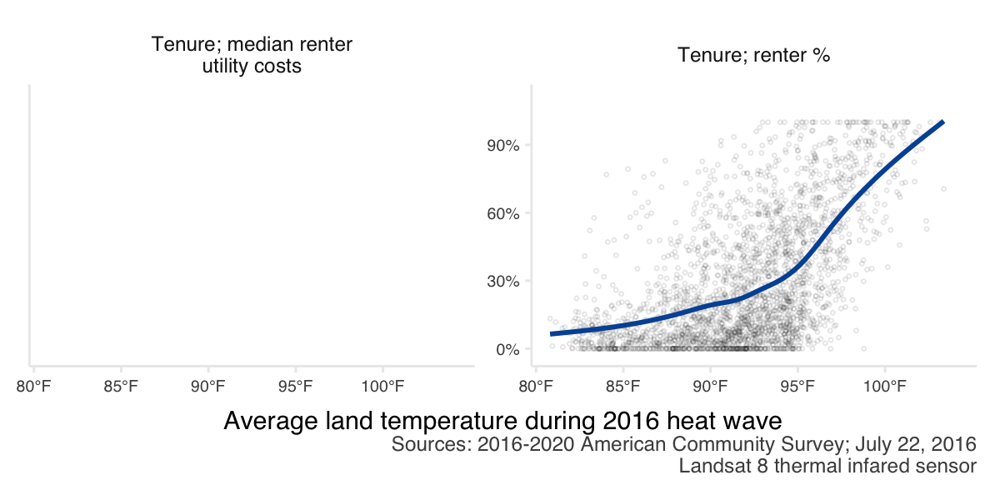

```{r include = F}
library(tidyverse)
library(lubridate)
library(councilR)
library(tidycensus)

knitr::opts_chunk$set(
  echo = F, message = F, warning = F, results = "hide",
  fig.pos = "H"
  # ,fig.height = 4
  , dpi = 300
)

`%not_in%` <- Negate(`%in%`)

```

# Introduction

The Metropolitan Council provides local planning assistance for communities across the Twin Cities region. As part of this assistance, the Council provides an “Extreme Heat Mapping Tool” for the Twin Cities. This tool shows the land surface temperature during the historic July 2016 heat wave and was created from remote-sensing data (Landsat 8). This dataset has proved particularly valuable as communities evaluate and plan for climate change adaptation techniques, future development and land use planning, and also undertake immediate interventions to reduce heat-related health consequences. 

The goal of this project is to do a major update of the data in order to better integrate the consequences of climate change into city planning and policy decisions, and ultimately help inform a more sustainable and healthier future for the Twin Cities region.  


# Map

Extreme heat in summer 2022. Multiple layers (heat in 2016 too)

## Methods

- Develop code to analyze thermal sensor data from the *new* Landsat 9 satellite. I've previously explored years 2016-2021 in Landsat 8, and the July 2016 heat wave is indeed historic (and has the best data clarity across the region; little cloud/smoke cover, etc.) 

## Results

```{r heatmap, fig.align = 'center', out.width = "70%", fig.cap = "Example heat map summer 2022", results='markup'}
knitr::include_graphics(("./heatmap.png"))
```


# Changing *RISK* of extreme heat

- analyze past trends of extreme heat; show possible futures too?? (link with greenhouse gas work)

## Methods

## Results

```{r warmstripes}
#| fig.cap = "Idea to show past trends",
#| results='markup', 
#| out.width= "3in",  
#| out.extra='style="float:right"', 
#| fig.align='right'
knitr::include_graphics(("./warmingstripes.png"))
```


```{r, fig.asp = .4, fig.cap = "Example trends showing a growing risk from extreme heat"}
mtcars %>%
  mutate(mpg = mpg * (-1),
         qsec = qsec * (-1),
         qsec3 = qsec,
         qsec2 = qsec) %>%
  pivot_longer(names_to = "names", values_to = "values", -mpg) %>%
  filter(names %in% c("qsec2", "qsec3")) %>%
  ggplot(aes(x = mpg, y = values)) + 
  facet_wrap(~names, scales = "free") +
  geom_point(alpha = .5) +
  geom_smooth(fill = NA, color = colors$councilBlue, method = "lm") +
  facet_wrap(~names,
          scales = "free", 
          nrow = 1, 
          strip.position = "left",
          labeller = as_labeller(c(qsec = str_wrap("Maximum summer temperature", 10), 
                                   qsec2 = str_wrap("Prolonged heat wave events (5 days or more w/ temps >90F)", 10),
                                   qsec3 = str_wrap("Days above 90F", 10)
                                   ))) +
  theme_council_open() +
  theme(strip.placement = "outside") +
  labs(x = "Year") +
  theme(axis.text = element_blank(),
        axis.title.y = element_blank(),
        strip.text.y.left = element_text(angle = 0)) #+
  # geom_hline(aes(yintercept = -13))
```

```{r, fig.asp = .4, fig.cap = "Example plot showing a lengthening season with extreme heat risk (terminology/idea akin to lengthening wildfire risk season out west)."}
 
hotcolors <- c("Earliest day >90F" = "green4", "Latest day >90F" = "darkorange2")
tibble(start = c(150, 160, 170, 180, 190),
        end = c(275, 270, 265, 260, 250),
       year = c(2022:2018)) %>%
  mutate(start = yday(as_date(start)),
         end = yday(as_date(end)),
         hot = end - start)  %>%
  ggplot(aes(x = year)) +
  geom_point(aes(y = start, color = "Earliest day >90F")) +
    geom_point(aes(y = end, color = "Latest day >90F")) +
  theme_council() +
    scale_color_manual(values = hotcolors)+
  geom_segment(aes(x = year, xend = year, y = start, yend = end), alpha = .5) +
  labs(x = "Year", y = "", col = "", title = "Lengthening of 'extreme heat' season")+
  scale_y_reverse(labels=function(x) strftime(chron::chron(x), "%b %d"), n.breaks = 6) 

```

# Social and economic *IMPACT* of extreme heat on residents

Our [website indicates](https://metrocouncil.org/Communities/Planning/Local-Planning-Assistance/CVA/Extreme-Heat.aspx) "Human vulnerability to extreme heat is of concern for many stakeholders in the region, particularly county public health departments and agency partners." Let's explicitly connect the dots between demographic data and land surface temperature!

## Methods

The demographic data comes from a combination of 2020 decennial census and 2016-2020 five-year American Community Survey (ACS) estimates. The 2020 decennial census is a full count of the population, but has few variables (currently limited to race and total population counts). On the other hand, the ACS five-year estimates offer more detailed demographic variables (for instance income, age, and language variables), but reflects only a sample (survey) of the total population.

The 2020 decennial census data was accessed from the [MN Geospatial Commons](https://gisdata.mn.gov/dataset/us-mn-state-metc-society-census2020population) and used only for race variables. The 2016-2020 ACS data was accessed using the [tidycensus](https://github.com/walkerke/tidycensus) wrapper for the [Census Bureau's API](https://www.census.gov/programs-surveys/acs/data/data-via-api.html). 

The heat data comes from Landsat 8 thermal infrared sensor data measured on July, 22 2016. **Ideally this will be updated to 2022 data!**


## Results

Across our region, certain populations have disproportionate exposure to extreme heat. In particular:

```{r process-demographics}
process_demos <- FALSE
source("./R/demographics.R")

process_heat <- FALSE
source("./R/heat.R")


# # this works for purrring/mapping everything
# df <- demographics %>% full_join(heat) %>%
#   separate(name, sep = "; ", into = c("type", "other"), remove = F) %>%
#   mutate(source = case_when(type ==  "Race" ~ "Sources: 2020 decennial census;\nJuly 22, 2016 Landsat 8 thermal infared sensor",
#                             TRUE ~ "Sources: 2016-2020 American Community Survey;\nJuly 22, 2016 Landsat 8 thermal infared sensor"),
#          labels = case_when(variable %in% c("income_median", "income_percapita") ~ "dollar",
#                             TRUE ~ "percent"),
#          height = case_when(type == "Race" ~ 6,
#                             TRUE ~ 3)) %>%
#   filter(!is.na(name), variable != "income_below185pov_percent") %>%
#   # group_by(type) %>% mutate(test = nlevels())
#   group_split(type)
# 
# 
# df %>%
#   purrr::map(~ggsave(paste0("figs/", first(.$type),'.png'), height = 3, width = 6, units = "in", dpi = 200,
#               ggplot(., aes(y = estimate, x = heat2016))+
#       geom_point(alpha = .1, pch = 21, size = .5) +
#                 facet_wrap(~.$name,
#                            scales = "free_y",
#                            labeller = label_wrap_gen((width = 25))) +
#   theme_council_open() +
#   geom_smooth(fill = NA, color = councilR::colors$councilBlue) +
#     # scale_y_continuous(labels = scales::comma) +
#   scale_y_continuous(labels = if (any(.$labels == "dollar")) scales::dollar else scales::percent) +
#     scale_x_continuous(labels = function(x) paste0(x, "°F"), breaks = seq(80, 100, by = 5), limits = c(80, 105), expand = c(.01, .01))+
#   # scale_y_continuous(labels = ~ if (any(.$.x > 1e3)) scales::dollar(.$.x) else .$.x) +
#   labs(x = "Average land temperature during 2016 heat wave",
#        y = "",
#        caption = str_wrap(paste0(first(.$source)), width = 60))
#        # caption = "Sources: 2020 decennial census, 2016-2020 American Community Survey, 2016 Landsat") #+
#   # theme(axis.title.x = element_text(size = ),
#   #       strip.text.x = element_text(size = 6),
#   #       strip.text.y = element_text(size = 6),
#   #       axis.text.y = element_text(size = 5),
#   #       axis.text.x = element_text(size = 5),
#   #       plot.caption = element_text(size = 5))
#   ))

# # this works for running a function on each variable type
df <- demographics %>% full_join(heat) %>%
  separate(name, sep = "; ", into = c("type", "other"), remove = F) %>%
  mutate(source = case_when(type ==  "Race" ~ "Sources: 2020 decennial census;\nJuly 22, 2016 Landsat 8 thermal infared sensor",
                            TRUE ~ "Sources: 2016-2020 American Community Survey;\nJuly 22, 2016 Landsat 8 thermal infared sensor"),
         labels = case_when(variable %in% c("income_median", "income_percapita") ~ "dollar",
                            TRUE ~ "percent"),
         height = case_when(type == "Race" ~ 6,
                            TRUE ~ 3)) %>%
  filter(!is.na(name), variable != "income_below185pov_percent")# %>%
  # group_by(type) %>% mutate(test = nlevels())
  # group_split(type)

heat_demo_plot <- function(x) {
  x %>%
    ggplot(aes(y = estimate, x = heat2016)) +
    geom_point(alpha = .1,
               pch = 21,
               size = .5) +
    facet_wrap( ~ name,
                # scales = "free_y",
                labeller = label_wrap_gen((width = 25))) +
    theme_council_open() +
    geom_smooth(fill = NA, color = councilR::colors$councilBlue) +
    scale_x_continuous(
      labels = function(x)
        paste0(x, "°F"),
      breaks = seq(80, 100, by = 5),
      limits = c(80, 105),
      expand = c(.01, .01)
    ) +
    labs(x = "Average land temperature during 2016 heat wave",
         y = "",
         caption = str_wrap(paste0(first(x$source)), width = 60))
}

filter(df, type == "Race") %>% 
  heat_demo_plot() +
  scale_y_continuous(labels = scales::percent)

```

### Age

Neither younger (under age 18) or older (65 or above) age groups who have increased sensitivity to extreme heat appear to be at an increased risk of exposure (Figure \@ref(fig:age-fig)).

```{r age-fig}
#| fig.cap = "Relationship between resident age and land surface temperature during a heat wave for census block groups across the 7-county Twin Cities metropolitan region. The blue line shows the trend line from a generalized additive model.",
#| results='markup', 
#| out.width= "6in",  
#| out.extra='style="float:right"', 
#| fig.align='right',
#| fig.asp = .6
filter(df, type == "Age") %>% 
  heat_demo_plot() +
  scale_y_continuous(labels = scales::percent)
```


### Communications (language and internet)

Hotter areas have greater percentages of residents who do not speak English at home. Hotter areas also have greater percentages of residents without internet at home. This indicates the value of communicating about heat warnings and mitigation strategies (e.g., location and hours of cooling centers) in multiple languages and via multiple platforms (Figure \@ref(fig:lang-fig)). 


```{r lang-fig}
#| fig.cap = "Relationship between languages spoken by residents and land surface temperature during a heat wave for census block groups across the 7-county Twin Cities metropolitan region. The blue line shows the trend line from a generalized additive model.",
#| results='markup', 
#| out.width= "6in",  
#| out.extra='style="float:right"', 
#| fig.align='right',
#| fig.asp = .6
filter(df, type == "Communications") %>% 
  heat_demo_plot() +
  scale_y_continuous(labels = scales::percent)
```

### Household size

People are more likely to be living alone (household size of 1) in areas with greater exposure to extreme heat (Figure \@ref(fig:hh-fig)). Social cohesion/connections can impact human vulnerability to extreme heat. From a safety perspective, people are always advised to check in on family and friends living alone during heat waves. Living alone may put people at an elevated risk. Fortunately, it does not seem that elders living alone have greater risk.

```{r hh-fig}
#| fig.cap = "Relationship between household size and land surface temperature during a heat wave for census block groups across the 7-county Twin Cities metropolitan region. The blue line shows the trend line from a generalized additive model.",
#| results='markup', 
#| out.width= "6in",  
#| out.extra='style="float:right"', 
#| fig.align='right',
#| fig.asp = .6
filter(df, type == "Households") %>% 
  heat_demo_plot() +
  scale_y_continuous(labels = scales::percent)
```

### Income

There are disparities in exposure to extreme heat with income. Lower income areas (median household income) tend to be exposed to hotter temperatures. Areas where a larger share of residents make less than 185% of the poverty rate are also exposed to hotter temperatures (Figure \@ref(fig:income-fig)).

```{r income-fig}
#| fig.cap = "Relationship between income and land surface temperature during a heat wave for census block groups across the 7-county Twin Cities metropolitan region. The blue line shows the trend line from a generalized additive model.",
#| results='markup', 
#| out.width= "6in",  
#| out.extra='style="float:right"', 
#| fig.align='right',
#| fig.asp = .6
filter(df, type == "Income") %>% 
  heat_demo_plot() +
  scale_y_continuous(labels = scales::dollar)
```


### Race

Areas where a greater percent of residents identify as a person of color tend to be hotter. Black and Hispanic residents seem to be disproportionately impacted (Figure \@ref(fig:race-fig)).


```{r race-fig}
#| fig.cap = "Relationship between resident's racial identity and land surface temperature during a heat wave for census block groups across the 7-county Twin Cities metropolitan region. The blue line shows the trend line from a generalized additive model.",
#| results='markup', 
#| out.width= "6in",  
#| out.extra='style="float:right"', 
#| fig.align='right'
filter(df, type == "Race") %>% 
  heat_demo_plot() +
  scale_y_continuous(labels = scales::percent)
```

### Tenure

Areas were more residents are renters are disproportionately hotter. This may indicate the need for particular types of mitigation strategies if renters have less agency to make structural (i.e., installing air conditioning units) or environmental (i.e., planting trees or landscaping interventions) changes to reduce heat exposure (Figure \@ref(fig:tenure-fig)).

Interestingly, the median utility cost for renters is lower in areas which are hotter. There may be some confounding factors going on however. For instance, utility costs may be low if some options for heating or cooling are not available (utility cost cannot be parsed by heating or cooling costs), and utility cost may be a function of preferences rather than energy efficiency. 


```{r tenure-fig}
#| fig.cap = "Relationship between resident housing tenure and land surface temperature during a heat wave for census block groups across the 7-county Twin Cities metropolitan region. The blue line shows the trend line from a generalized additive model.",
#| results='markup', 
#| out.width= "6in",  
#| out.extra='style="float:right"', 
#| fig.align='right',
#| fig.asp = .6
# 
filter(df, type == "Tenure") %>% 
  heat_demo_plot() +
    facet_wrap( ~ name,
                # scales = "free_y",
                labeller = label_wrap_gen((width = 25))) +
  scale_y_continuous(labels = scales::percent)
```


# *MITIGATION* and *ADAPTATION* strategies for extreme heat 

If rising temperatures are inevitable, how are residents/cities going to adapt/mitigate impact? Aka Link variables about the built and natural environments

- tree canopy (link with growing shade) / impervious surfaces (link with surface with purpose and/or localized flooding); **show how land use decisions impact local temperatures**
- housing metrics from ztrax zillow data; is there an "adaptation gap" to extreme heat? (idea = systemic structural/economic/racial issues may also manifest as no cooling available to residents to mitigate extreme heat). with ztrax consider if we can get cooling data directly from county assessors or parcel data (and keep in mind that county-to-county might be challenging to compare.) maybe consider age of housing stock too (thinking about energy efficiency, etc.)

**ADD OVERLAY MAPS** to the storymap! (kind of like how land use is there now, but try to be more explicit? think about how the data could be compelling to inform landscape architecture, etc.)

## Methods

## Results

```{r, fig.asp = .3, fig.cap="Example plots showing how the built/natural environments interact with extreme heat."}
mtcars %>%
  mutate(mpg = mpg * (-1),
         qsec = qsec * (-1),
         wt2 = wt,
         wt = wt * (-1)) %>%
  pivot_longer(names_to = "names", values_to = "values", -mpg) %>%
  filter(names %in% c("qsec", "wt", "wt2")) %>%
  ggplot(aes(x = mpg, y = values)) + 
  facet_wrap(~names, scales = "free") +
  geom_point(alpha = .5) +
  geom_smooth(fill = NA, color = colors$councilBlue, method = "lm") +
  facet_wrap(~names,
          scales = "free", 
          nrow = 1, 
          strip.position = "left",
          labeller = as_labeller(c(qsec = str_wrap("Residences with air conditioning (%)", 10), 
                                   # wt = str_wrap("Owner occupied residences (%)", 20)
                                   wt = str_wrap("Impervious surfaces (%)", 10),
                                   wt2 = str_wrap("Tree canopy in 2021 (%)", 10)
                                   ))) +
  theme_council_open() +
  theme(strip.placement = "outside") +
  labs(x = "Land surface temperature during (date) heatwave") +
  theme(axis.text = element_blank(),
        axis.title.y = element_blank(),
        strip.text.y.left = element_text(angle = 0))
```


```{r}
load("/Users/escheh/Documents/GitHub/planting.shade/data/mn_bgs.rda")

df <- mn_bgs %>% sf::st_drop_geometry() %>%
  right_join(heat, by = c("GEOID" = "bg20"))

df %>%
  ggplot(aes(x = heat2016, y = canopy_percent)) +
  geom_point() +
  geom_smooth(fill = NA, color = colors$councilBlue)
  
```

# Narrative 

Update StoryMap. Consider UofM RCP program - could students do some of this qualitative data gathering? 

Idea: is it possible to capture a personal/neighborhood experience of heat? **Human vulnerability**

## Cooling centers

Is it possible to map them? Or have definitions become standardized? $ vs free, etc. 
Splash pads?

## Landscaping

EAB, commercial landscaping, etc. 

## Health outcomes

- Anything with co-morbidities / the study Baltimore did about heat and deaths?

## Grassroots efforts

grassroots efforts related to heat (green roofs, heat pumps/cooling, programs $ nonprofits providing relief, building social connections/safety in extreme heat)


# Disemination 

- How to engage stakeholders and provide educational opportunities around the update?
- Plan for COW presentation? 
- Update MN Geospatial commons data
- Would communications folks want to be engaged?

Should drought be included here? 

# Game Plan

1) Build GEE model to get 2022 heat data
2) Start to link people into the story (demographics/etc)
  - this can be done with old 2016 data too
  - stories - this is a bigger lift, consider RCP stuff later
3) Contextualize 2016 data
  - how historic was 2016? or was it just good to measure (clouds, smoke impact readings in 2021)
  - if 2022 has a similar event, has there been an expansion or contraction in the vulnerable area of our region (likely driven by development patterns, land use, etc). vulnerable = areas at risk from extreme heat.
  - map the expansion of vulnerability, overlay with development?
  - show rising median/mean temps (with change in other variables like eab?)
