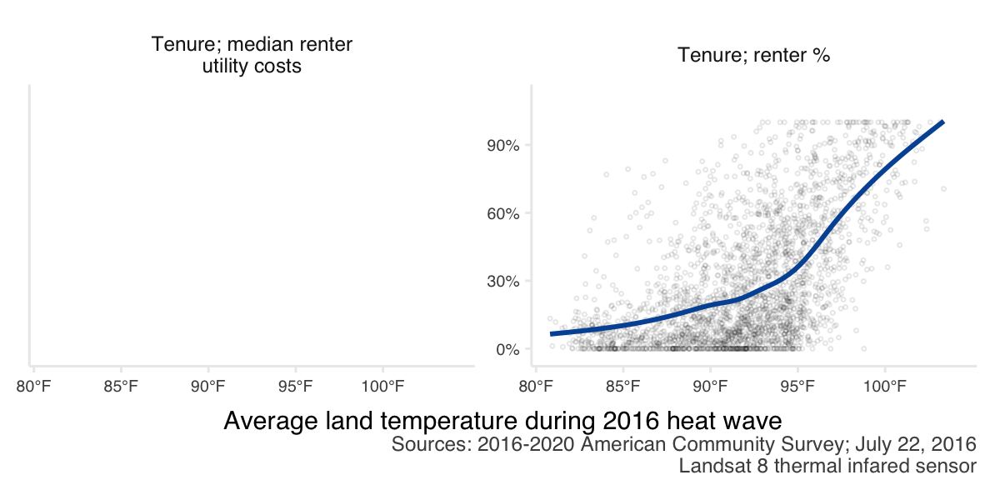

```{r include = F}
# library(tidyverse)
library(councilR)
library(tidycensus)
library(patchwork)
library(tidyverse)

knitr::opts_chunk$set(
  echo = F, message = F, warning = F, results = "hide",
  fig.pos = "H"
  # ,fig.height = 4
  , dpi = 300
)

`%not_in%` <- Negate(`%in%`)

```

# Introduction

The Metropolitan Council provides local planning assistance for communities across the Twin Cities region. As part of this assistance, the Council provides an “Extreme Heat Mapping Tool” for the Twin Cities. This tool shows the land surface temperature during the historic July 2016 heat wave and was created from remote-sensing data (Landsat 8). This dataset has proved particularly valuable as communities evaluate and plan for climate change adaptation techniques, future development and land use planning, and also undertake immediate interventions to reduce heat-related health consequences. 

The goal of the 2023 update on extreme heat is to do a major addition to the existing body of work. We hope to better integrate the consequences of climate change into city planning and policy decisions, give stakeholders tools to act on mitigating the risk of extreme heat, and ultimately help inform a more sustainable and healthier future for the Twin Cities region.  

# Community specific temperatures

```{r}
ctus <- read_csv(file.path(here::here(), "r_postprocessing/data-raw/ExtremeHeat2022_ctus_max.csv"),
                 col_select = c(CTU_NAME, LST = max_LST)) %>%
  add_column(type = "max_LST") %>%
  bind_rows(read_csv(file.path(here::here(), "r_postprocessing/data-raw/ExtremeHeat2022_ctus_min.csv"),
                 col_select = c(CTU_NAME, LST = min_LST)) %>%
              add_column(type = "min_LST")) %>%
  bind_rows(read_csv(file.path(here::here(), "r_postprocessing/data-raw/ExtremeHeat2022_ctus_mean.csv"),
                 col_select = c(CTU_NAME, LST = mean_LST)) %>%
              add_column(type = "mean_LST")) %>%
    mutate(LST = stringr::str_remove_all(LST, "\\{LST=|\\}|null"),
           LST = as.numeric(LST)) %>%
  pivot_wider(names_from = type, values_from = LST) %>%
  arrange(CTU_NAME) %>%
  select(CTU_NAME, min_LST, mean_LST, max_LST)

write_csv(ctus, file = file.path(here::here(), "r_postprocessing/figs/ctu_average.csv"))


ctus %>%
  arrange(mean_LST) %>%
  mutate(CTU_NAME = fct_reorder(CTU_NAME, mean_LST)) %>%
  mutate(color = c(
      colorRampPalette(RColorBrewer::brewer.pal(9, "Blues")[8:3])(nrow(ctus)/2),
      colorRampPalette(RColorBrewer::brewer.pal(9, "Reds")[3:8])(nrow(ctus)/2))) %>%
  ggplot(aes(y = mean_LST, x = CTU_NAME, color = color
             # ,xmin = min_LST, xmax = max_LST
             ))  +
  geom_segment(aes(xend=CTU_NAME, yend=-Inf), color = "grey90") + 
  geom_point() +
  geom_text(aes(label = format(round(mean_LST, 1), nsmall = 1)), color = "black", hjust = -.5, size = 2) +
  scale_colour_identity()+
  coord_flip() +
  theme_council_open() +
  theme(axis.title.y = element_blank(),
        axis.title.x = element_blank()) +
  scale_y_continuous(expand = expansion(mult = c(0, 0.2))) +
  labs(title = "Average temperature (land surface 2022)")
  # geom_pointrange()

ggsave(file = file.path(here::here(), "r_postprocessing/figs/ctu_average.png"),
       height = 20, width = 6)
```

# Methods

### Land surface temperature versus air temperature

Not the same thing, but well correlated. 


```{r, include = F, eval = F}
landsat8dates <- seq(from = ymd("2013-05-11"), to = ymd("2022-11-01"), by = "16 days")
landsat9dates <- seq(from = ymd("2021-11-01"), to = ymd("2022-11-01"), by = "16 days")


remove <- metro_stations_daily %>%
  mutate(month = month(ymd(date))) %>% 
  filter(month >= 5, month <= 9, 
         datatype == "TMAX",
         ymd(date) %in% c(landsat8dates, landsat9dates))  %>%
  complete(date, station) %>%
  filter(is.na(value)) %>%
  select(station) %>%
  unique()
  
df <- metro_stations_daily %>%
  mutate(month = month(ymd(date))) %>% 
  filter(month >= 5, month <= 9, 
         datatype == "TMAX",
         ymd(date) %in% c(landsat8dates, landsat9dates)) %>% #filter(date == ymd('2022-05-28'))#,
         # station %not_in% c(remove$station)) #%>% 
  group_by(date) %>%
  summarise(MEAN = mean(value), SD = sd(value), n_stations = n()) %>%
  filter(MEAN >= 85) 

df %>%
  ggplot(aes(x = ymd(date), y = MEAN)) +
  geom_point() +
  geom_errorbar(aes(ymin = MEAN - SD, ymax = MEAN + SD)) +
  geom_point(data = filter(df, date == ymd("2016-07-22")), col = "brown2", size = 3) +
  theme_council_open() +
  scale_x_date(date_breaks = "1 year", date_labels = "%Y")
  # ggplot(aes(x = date, y = value, col = station)) +
  # geom_point() #+
  # # geom_errorbar(aes())


avg_heat <- read_csv(
  paste0("./data/metc_extremeheat/", list.files("./data/metc_extremeheat/", pattern = "heatac")),
  col_select = c(year, CTU_NAME, avg_lst, regionAvg, regionSD),
  id = "year"
  ) %>%
  mutate(year = as.numeric(str_remove_all(year, ("./data/metc_extremeheat/heatacres_|.csv"))),
         avg_lst = as.numeric(str_remove_all(avg_lst, "\\{LST=|\\}"))) %>%
    mutate(diff = avg_lst - regionAvg)

# confirm that 2016 is the hottest year
avg_heat %>%
  group_by(CTU_NAME) %>%
  mutate(hottest_temp = max(avg_lst)) %>%
  filter(avg_lst == hottest_temp) %>%
  ungroup() %>% count(year)
  
avg_heat %>%
  filter(year != 2013) %>% #patchy clouds
  ggplot(aes(y = diff, x = as.character(year),group = CTU_NAME)) +
  geom_point(position = position_dodge(width = .4))+
  geom_line(alpha = .4, position = position_dodge(width = .4)) +
  theme_council_open() + 
  geom_hline(yintercept = 0)

  ggplot() +
geom_point(aes(y = avg_lst, x = (year), group = CTU_NAME),
  data = filter(avg_heat, year != 2013),
position = position_dodge(width = .4))+
  geom_line(aes(y = avg_lst, x = (year), group = CTU_NAME),
  data = filter(avg_heat, year != 2013),
  alpha = .4, position = position_dodge(width = .4)) +
    geom_point(col = "red", size = 4, 
               aes(x = year, y = regionAvg), 
               data = (avg_heat %>% distinct(year, regionAvg) %>%
                         filter(year != 2013))) +
    theme_council_open() 
  
  avg_heat %>%filter(year == 2021) %>%
    arrange(-avg_lst)

```


During the summer months, LandSat land surface temperatures and air temperatures line up pretty well at the airport (Figure \@ref(fig:temp-corr)). 

```{r temp-corr}
#| fig.cap = "Average temperatures in Minnesota from 1895-2021. Source NOAA and https://showyourstripes.info.",
#| results='markup', 
#| out.width= "5in",  
#| out.extra='style="float:right"', 
#| fig.align='right'

# gee data from HeatHistory.js

load("./data/msp_daily.rda")
gee <-
read_csv("./data/GEE_MSP_HeatHistory.csv",
         col_types = c("system:time_start" = "c",
                       "LST_L8" = "d",
                       "LST_L9" = "d")) %>%
  # pivot_longer(names_to = "source", values_to = "temp", -`system:time_start`) %>%
  # filter(!is.na(temp)) %>%
  # mutate(temp = (temp - 273.15) * (9/5) + (32)) %>%
  mutate(date = as.Date(`system:time_start`, format = "%b %d, %Y")) %>%
  mutate(across(where(is.numeric), ~ (.x - 273.15) * (9/5) + (32))) %>%
  select(-`system:time_start`) %>% 

  left_join(msp_daily %>%
              filter(datatype == "TMAX") %>%
              select(date, value) %>%
              rename("air_temp" = value)) %>%
  pivot_longer(names_to = "source2", values_to = "temp", -c(date, air_temp)) %>%
  filter(!is.na(temp)) %>%
  mutate(doy = yday(date)) %>%
  mutate(flag = if_else(source2 == "LST_L7" & date > ymd("2003-06-01"), 9, 1)) %>% #remove when scan line errors started
  filter(flag == 1)

# gee %>%
#   filter(doy > yday(ymd("2020-05-01")),
#          doy < yday(ymd("2020-10-01"))) %>%
#   mutate(diff= temp - air_temp) %>%
#   ggplot(aes(x = date,  col = source)) +
#   geom_point(aes(y = diff)) +
#   # geom_point(aes(y = temp)) +
#   # geom_point(aes(y = air_temp),col = "black") +
#   geom_hline(yintercept = 0) +
#   theme_council_open() +
#   geom_vline(xintercept = ymd("2016-07-26"))

gee %>%
  filter(doy > yday(ymd("2020-05-01")),
         doy < yday(ymd("2020-10-01")),
         source2 != "LST_L4") %>%
  mutate(type = case_when(air_temp < 85 ~ "mild",
                          # air_temp < 90 ~ "moderate",
                          TRUE ~ "hot")) %>% #filter(source == "LST_L7")
  ggplot(aes(x = air_temp, y = temp, col = source2)) +
  geom_point(alpha = .5)+#aes(col = source)) +
  theme_council_open() +
  geom_smooth(method = "lm", fill = NA)+#, col = "black") +
  labs( x = "Airport air temperature",
        y = str_wrap("Airport land surface temperature", 10),
        col = "Landsat",
        caption = "Summer (May 1 - Oct 1) MSP airport land temperatures correlate with air temperatures.\nLandsat 7 data is only shown before the scan line error failure (pre 2003).") +
  scale_color_brewer(palette =  "Paired") +
  facet_wrap(~source2)+
  guides(col = "none")
  # facet_wrap(~type, scales = "free")

# ls4 --> 1982-08-22T14:19:55 - 1993-12-14T00:00:00 #somehow this seems redundant with ls 5, so remove. 
# ls5 --> 1984-04-19T13:56:39 - 2011-11-08T14:18:44


mod_df <- gee %>%
  filter(doy > yday(ymd("2020-05-01")),
         doy < yday(ymd("2020-10-01")),
         source2 %in% c("LST_L8", "LST_L9")) 
summary(lm(temp ~ air_temp, data = mod_df))
mod_b <- 20.1142
mod_m <- 0.7635

# mod_m * (86) + mod_b

  
  ggplot(aes(x = air_temp, y = temp, col = source2), data = mod_df) +
  geom_point(alpha = .5)+#aes(col = source)) +
  theme_council_open() +
  geom_smooth(method = "lm", fill = NA, col = "black") +
  labs( x = "Airport air temperature",
        y = str_wrap("Airport land surface temperature", 10),
        col = "Landsat",
        caption = "Summer (May 1 - Oct 1) MSP airport land temperatures correlate with air temperatures.\nLandsat 7 data is only shown before the scan line error failure (pre 2003).") +
  scale_color_brewer(palette =  "Paired") +
  # facet_wrap(~source2)+
  guides(col = "none") +
    geom_abline(slope = 1, intercept = 0, lty = 2)
```

### Data processing; statistics

GEE, reference points, standard deviations

## Demographic and social data

### Census

The demographic data comes from a combination of 2020 decennial census and 2016-2020 five-year American Community Survey (ACS) estimates. The 2020 decennial census is a full count of the population, but has few variables (currently limited to race and total population counts). On the other hand, the ACS five-year estimates offer more detailed demographic variables (for instance income, age, and language variables), but reflects only a sample (survey) of the total population.

The 2020 decennial census data was accessed from the [MN Geospatial Commons](https://gisdata.mn.gov/dataset/us-mn-state-metc-society-census2020population) and used only for race variables. The 2016-2020 ACS data was accessed using the [tidycensus](https://github.com/walkerke/tidycensus) wrapper for the [Census Bureau's API](https://www.census.gov/programs-surveys/acs/data/data-via-api.html). 


# Results


## Changing *RISK* of extreme heat

### Historic temperature trends

Minnesota's temperatures have been warming over the past century, with warming trends accelerating since 2000 (Figure \@ref(fig:mn-warmingstripes-avg)). Warmer winters and rising daily low temperatures strongly contribute to this trend. 

```{r, mn-warmingstripes-avg}
#| fig.cap = "Average temperatures in Minnesota from 1895-2021. Source NOAA and https://showyourstripes.info.",
#| results='markup', 
#| out.width= "5in",  
#| out.extra='style="float:right"', 
#| fig.align='right'

knitr::include_graphics("./NORTH_AMERICA-USA-Minnesota-1895-2021-NO-barslabel.png")
```

Hotter summer temperatures are also a component of a warming world, and heat waves have direct consequences on human health. In Minnesota, warming summer trends (probably) include (Figure \@ref(fig:msp-temps)):

- neither annual maximum temperatures nor average summer highs have changed much, but
- heat waves (multiple days of extreme heat) are more common
- daily minimum temperatures are warmer


```{r, msp-temps, fig.asp = 1, out.width= "6in", fig.cap = "Summer air temperatures (May 1 - Oct 1) at MSP airport since records began at that station. The shaded box shows the years which overlap with Landsat satellite data availability. The horizontal red dashed line shows 100 degrees F, and the vertical grey dashed line indicates year 2016 which is currently used to quanify the risk of extreme heat across the Twin Cities region."}
load("./data/msp_temps.rda")

landsat_yrs <- tibble(datatype = c("TMAX", "TMIN"),
                      lsy = c(88, 70), 
                      lsyend = c(106, 90))

msp_temps %>% filter(datatype %in% c("TMAX", "TMIN")) %>%
  mutate(plot = if_else(datatype == "TMAX", max, mean)) %>%
  bind_rows(msp_temps %>% filter(datatype == "TMAX") %>%
              mutate(plot = mean,
                     datatype = "TMAXmean")) %>%
  filter(year != 2022) %>%
  ggplot(aes(x = year, y = plot)) + #, col = doy
  geom_hline(data = data.frame(datatype = "TMAX"), aes(yintercept = 100), lty = 2, col = "red") +
  geom_vline(xintercept = 2016, lty = 2, col = "grey50") +
  # geom_rect(data = data.frame(datatype = "TMAX"), aes(xmin = 1983, xmax = 2022, ymin = -Inf, ymax = Inf), alpha = 0.1, fill="grey", inherit.aes = FALSE) +
  # geom_rect(data = data.frame(datatype = "TMIN"), aes(xmin = 1983, xmax = 2022, ymin = -Inf, ymax = Inf), alpha = 0.1, fill="grey", inherit.aes = FALSE) +
  annotate("rect", xmin = 1983, xmax = 2022, ymin = -Inf, ymax = Inf, alpha = .1) +
  geom_line(col = "grey 50") +
  geom_point() +
  councilR::theme_council_open() +
  labs(y = "", #str_wrap("Air temperature", 10),
       x = "", 
       title = "MSP airport air temperature") +
  scale_x_continuous(expand = c(.01,0)) +
  scale_colour_gradient(
    low = "#132B43",
    high = "#56B1F7",
    space = "Lab",
    # guide = "legend",
    aesthetics = "colour",
    breaks=c(lubridate::yday(ymd("2022-06-01")), 
             lubridate::yday(ymd("2022-07-01")),
             lubridate::yday(ymd("2022-08-01")),
             lubridate::yday(ymd("2022-09-01"))),
    labels=c("June 1",
             "July 1",
             "Aug 1",
             "Sept 1"),
    name = "Date"
  ) +
  annotate("text", label = "2016", x = 2016, y = -Inf, vjust = -1) +
  annotate("text", label = "Landsat era", x = 2005, y = Inf, vjust = 1) +
  facet_wrap(~datatype, ncol = 1, scales = "free_y",
             labeller = as_labeller(c(TMAX = "Hottest summer temperature recorded", 
                                      TMIN = "Average summer lows",
                                      TMAXmean = "Average summer highs"))) +
  scale_y_continuous(labels = function(x) paste0(x, "°F"))

#may - sept
```


## Social and economic *IMPACT* of extreme heat on residents

Our [website indicates](https://metrocouncil.org/Communities/Planning/Local-Planning-Assistance/CVA/Extreme-Heat.aspx) "Human vulnerability to extreme heat is of concern for many stakeholders in the region, particularly county public health departments and agency partners." Let's explicitly connect the dots between demographic data and land surface temperature!

Indeed, certain populations have disproportionate exposure to extreme heat across our region. Below, we show the percent population in each of the regions 4822 census block groups (2020 vintage geographies) according to various demographic attributes. We also show the region's total population which lives in various temperature exposure areas. 

**Logically, it would make sense to update the temperature data to be 2021/2022 values here**

```{r process-demographics}
process_demos <- FALSE
source("./R/demographics.R")

process_heat <- FALSE
source("./R/heat.R")


# # this works for purrring/mapping everything
# df <- demographics %>% full_join(heat) %>%
#   separate(name, sep = "; ", into = c("type", "other"), remove = F) %>%
#   mutate(source = case_when(type ==  "Race" ~ "Sources: 2020 decennial census;\nJuly 22, 2016 Landsat 8 thermal infared sensor",
#                             TRUE ~ "Sources: 2016-2020 American Community Survey;\nJuly 22, 2016 Landsat 8 thermal infared sensor"),
#          labels = case_when(variable %in% c("income_median", "income_percapita") ~ "dollar",
#                             TRUE ~ "percent"),
#          height = case_when(type == "Race" ~ 6,
#                             TRUE ~ 3)) %>%
#   filter(!is.na(name), variable != "income_below185pov_percent") %>%
#   # group_by(type) %>% mutate(test = nlevels())
#   group_split(type)
# 
# 
# df %>%
#   purrr::map(~ggsave(paste0("figs/", first(.$type),'.png'), height = 3, width = 6, units = "in", dpi = 200,
#               ggplot(., aes(y = estimate, x = heat2022))+
#       geom_point(alpha = .1, pch = 21, size = .5) +
#                 facet_wrap(~.$name,
#                            scales = "free_y",
#                            labeller = label_wrap_gen((width = 25))) +
#   theme_council_open() +
#   geom_smooth(fill = NA, color = councilR::colors$councilBlue) +
#     # scale_y_continuous(labels = scales::comma) +
#   scale_y_continuous(labels = if (any(.$labels == "dollar")) scales::dollar else scales::percent) +
#     scale_x_continuous(labels = function(x) paste0(x, "°F"), breaks = seq(80, 100, by = 5), limits = c(80, 105), expand = c(.01, .01))+
#   # scale_y_continuous(labels = ~ if (any(.$.x > 1e3)) scales::dollar(.$.x) else .$.x) +
#   labs(x = "September 2022 land temperature",
#        y = "",
#        caption = str_wrap(paste0(first(.$source)), width = 60))
#        # caption = "Sources: 2020 decennial census, 2016-2020 American Community Survey, 2016 Landsat") #+
#   # theme(axis.title.x = element_text(size = ),
#   #       strip.text.x = element_text(size = 6),
#   #       strip.text.y = element_text(size = 6),
#   #       axis.text.y = element_text(size = 5),
#   #       axis.text.x = element_text(size = 5),
#   #       plot.caption = element_text(size = 5))
#   ))

# # this works for running a function on each variable type
df <- filter(demographics, data == "percents") %>% full_join(heat) %>%
  separate(name, sep = "; ", into = c("type", "other"), remove = F) %>%
  mutate(source = case_when(type ==  "Race" ~ "Sources: 2020 decennial census;\n2022 Landsat and Sentinel-2 spectral reflectance",
                            TRUE ~ "Sources: 2017-2021 American Community Survey;\n2022 Landsat and Sentinel-2 spectral reflectance"),
         labels = case_when(variable %in% c("income_median", "income_percapita") ~ "dollar",
                            TRUE ~ "percent"),
         height = case_when(type == "Race" ~ 6,
                            TRUE ~ 3)) %>%
  filter(!is.na(name)) %>% #, variable != "income_below185pov_percent") %>%
  mutate(name = gsub(".*;", "", name),
         name = gsub("%", "", name),
         name = str_to_sentence(name))
  # group_by(type) %>% mutate(test = nlevels())
  # group_split(type)

heat_demo_plot <- function(x) {
  x %>%
    ggplot(aes(y = estimate, x = heat2022)) +
    geom_point(alpha = .1,
               pch = 21,
               size = .5) +
    facet_wrap( ~ name,
                # scales = "free_y",
                labeller = label_wrap_gen((width = 25))) +
    theme_council_open() +
    geom_smooth(fill = NA, color = councilR::colors$councilBlue) +
    scale_x_continuous(
      labels = function(x)
        paste0(x, "°F"),
      # breaks = seq(80, 100, by = 10),
      # limits = c(80, 105),
      expand = c(.01, .01)
    ) +
    labs(x = "September 2022 land temperature",
         y = "", title = "Block group percents"
         ,caption = str_wrap(paste0(first(x$source)), width = 50)
         ) +
    theme(plot.title = element_text(size = 10, face = "bold") )
}


### persons
# coolest <- quantile(heat$heat2022, .2, na.rm = T)
# cool <- quantile(heat$heat2022, .4, na.rm = T)
# avgheat <- quantile(heat$heat2022, .6, na.rm = T)
# hot <- quantile(heat$heat2022, .8, na.rm = T)

coolest <- 93
cool <- 94
avgheat <- 95
hot <- 99

coolest_lab <- paste0("<", round(coolest, 0))
cool_lab <- paste0(round(coolest, 0) + 0, "-", round(cool, 0))
avgheat_lab <- paste0(round(cool, 0) + 0, "-", round(avgheat, 0))
hot_lab <- paste0(round(avgheat, 0) + 0, "-", round(hot, 0))
hottest_lab <- paste0(round(hot, 0) + 0, "+")


df1 <- filter(demographics, data == "percents") %>% full_join(heat) %>%
  separate(name, sep = "; ", into = c("type", "other"), remove = F) %>%
  mutate(name = str_replace(name, "% ", "total "),
         source = case_when(type ==  "Race" ~ "Sources: 2020 decennial census;\n2022 Landsat and Sentinel-2 spectral reflectance",
                            TRUE ~ "Sources: 2017-2021 American Community Survey;\n2022 Landsat and Sentinel-2 spectral reflectance"),
         labels = case_when(variable %in% c("income_median", "income_percapita") ~ "dollar",
                            TRUE ~ "percent"),
         height = case_when(type == "Race" ~ 6,
                            TRUE ~ 3)) %>%
  filter(!is.na(name)) %>% #, variable != "income_below185pov_percent") %>%
  mutate(tempbin = case_when(heat2022 < coolest ~ coolest_lab,
                             heat2022 < cool ~ cool_lab,
                             heat2022 <  avgheat ~ avgheat_lab,
                             heat2022 < hot ~ hot_lab,
                             TRUE ~ hottest_lab)) %>%
    mutate(tempbin = factor(tempbin, levels=c(hottest_lab, hot_lab, avgheat_lab, cool_lab, coolest_lab))) %>%
    # mutate(tempbin = factor(tempbin, levels=c("85+", "80-84", "75-79", "70-74", "<70"))) %>%
    arrange(tempbin) %>%
   group_by(type, variable, tempbin, name, source) %>%
   summarise(persons = sum(estimate)) %>%
  ungroup() %>% group_by(variable) %>% mutate(totaln = sum(persons)) %>%
  mutate(label = paste0(round(persons / totaln *100, 1), "%"),
         lab_y = persons/totaln,
         label_y = cumsum(persons/totaln)) 

heat_persons_plot <- function(x) {
 # filter(df1, type == "Age")  %>%
  x %>%
   # complete()
    ggplot(aes(y = persons, x = name, fill = tempbin)) +
    geom_bar(stat = "identity", position = "fill") +
    # facet_wrap( ~ name,
    #             scales = "free",
    #             labeller = label_wrap_gen((width = 25))) +
    theme_council_open() +
  scale_fill_brewer(palette = "RdBu")+#, direction = -1) +
   scale_x_discrete(labels = scales::wrap_format(25)) +
   theme(#axis.text.x = element_blank(),
         plot.title = element_text(size = 10, face = "bold") ,
         legend.position = "bottom")+
   scale_y_continuous(labels = scales::percent) +
  geom_text(aes(label = if_else(lab_y <.05, NA_character_, label), y = lab_y),position = "stack", vjust = 1.5,
        size = 3) +
    labs(y = "", x = "", fill = "September 2022\nland temperature", title = "Regional totals", caption = paste0(first(x$source))#str_wrap(paste0(first(x$source)), width = 50)
         # caption = str_wrap(paste0(first(x$source)), width = 60)
         ) 
}
```

### Age

Neither younger (under age 18) or older (65 or above) age groups who have increased sensitivity to extreme heat appear to be at an increased risk of exposure (Figure \@ref(fig:age-fig)). About 20% of the region's total population of a sensitive age lives in a block group with temperatures over 95 degrees.

```{r, age-fig}
#| fig.cap = "Relationship between resident age and land surface temperature during a heat wave for census block groups across the 7-county Twin Cities metropolitan region. The blue line shows the trend line from a generalized additive model.",
#| results='markup', 
#| out.width= "6in",  
#| out.extra='style="float:right"', 
#| fig.align='right',
#| fig.asp = 1.3
age <- (filter(df, type == "Age") %>% 
  heat_demo_plot() +
  scale_y_continuous(labels = scales::percent)) /

filter(df1, type == "Age") %>% 
  heat_persons_plot()

age
ggsave(age, filename = "/Users/escheh/Desktop/age.png", width = 6, height = 8, device = "png")

```


### Communications (language and internet)

Hotter areas have greater percentages of residents who do not speak English at home. Hotter areas also have greater percentages of residents without internet at home. This indicates the value of communicating about heat warnings and mitigation strategies (e.g., location and hours of cooling centers) in multiple languages and via multiple platforms (Figure \@ref(fig:lang-fig)). Over 30% of the region's total population without internet at home lives in areas with extreme heat in excess of 95 degrees, while only about 20% of the region's total population with internet lives in similarly hot areas. 


```{r, lang-fig}
#| fig.cap = "Relationship between languages spoken by residents and land surface temperature during a heat wave for census block groups across the 7-county Twin Cities metropolitan region. The blue line shows the trend line from a generalized additive model.",
#| results='markup', 
#| out.width= "6in",  
#| out.extra='style="float:right"', 
#| fig.align='right',
#| fig.asp = 1.3
(filter(df, type == "Communications",
        variable != "comm_cellonly_percent",
        variable != "comm_yesinternet_percent") %>% 
  heat_demo_plot() +
  scale_y_continuous(labels = scales::percent)) /

filter(df1, type == "Communications",
        variable != "comm_cellonly_percent",
       variable != "comm_yesinternet_percent") %>% 
  heat_persons_plot() +
  scale_y_continuous(labels = scales::percent)
```

### Household size

People are more likely to be living alone (household size of 1) in areas with greater exposure to extreme heat (Figure \@ref(fig:hh-fig)). About 30% of our region's 1-person households live in areas which can experience heat of 95 degrees or more. Social cohesion/connections can impact human vulnerability to extreme heat. From a safety perspective, people are always advised to check in on family and friends living alone during heat waves. Living alone may put people at an elevated risk. Fortunately, it does not seem that elders living alone have greater risk.

```{r, hh-fig}
#| fig.cap = "Relationship between household size and land surface temperature during a heat wave for census block groups across the 7-county Twin Cities metropolitan region. The blue line shows the trend line from a generalized additive model.",
#| results='markup', 
#| out.width= "6in",  
#| out.extra='style="float:right"', 
#| fig.align='right',
#| fig.asp = 1.3
hhsize <- (filter(df, type == "Households") %>% 
  heat_demo_plot() +
  scale_y_continuous(labels = scales::percent))/

filter(df1, type == "Households") %>% 
  heat_persons_plot() +
  scale_y_continuous(labels = scales::percent)

hhsize
ggsave(hhsize, filename = "/Users/escheh/Desktop/hhsize.png", width = 6, height = 8, device = "png")

```

### Income

There are disparities in exposure to extreme heat with income. Lower income areas (median household income) tend to be exposed to hotter temperatures. Areas where a larger share of residents make less than 185% of the poverty rate are also exposed to hotter temperatures (Figure \@ref(fig:income-fig)).

```{r, income-fig}
#| fig.cap = "Relationship between income and land surface temperature during a heat wave for census block groups across the 7-county Twin Cities metropolitan region. The blue line shows the trend line from a generalized additive model.",
#| results='markup', 
#| out.width= "6in",  
#| out.extra='style="float:right"', 
#| fig.align='right',
#| fig.asp = .6

income <- ((filter(df, type == "Income"
                 ,!str_detect(variable, "100pov|185pov")
                 ) %>% 
  heat_demo_plot() +
  scale_y_continuous(labels = scales::dollar)) /
  
   filter(df1, type == "Income", str_detect(variable, "185pov|100pov")) %>% 
  heat_persons_plot() +
  scale_y_continuous(labels = scales::percent))
income
ggsave(income, filename = "/Users/escheh/Desktop/income.png", width = 6, height = 8, device = "png")


(filter(df, type == "Income"
                 ,!str_detect(variable, "185pov|100pov|percapita")
                 ) %>% 
  heat_demo_plot() +
  scale_x_continuous(labels = scales::dollar))

# filter(df1, type == "Income", !str_detect(variable, "180pov")) %>% 
#   heat_persons_plot() +
#   scale_y_continuous(labels = scales::percent)

```

```{r}
filter(df, type == "Income", variable == "income_median") %>% 
  ggplot(aes(x = estimate, y = heat2022)) +
    geom_point(alpha = .2,
               pch = 16,
               size = .5) +
    # facet_wrap( ~ name,
    #             labeller = label_wrap_gen((width = 25))) +
    theme_council_open() +
    geom_smooth(fill = NA, color = councilR::colors$councilBlue) +
    scale_y_continuous(
      labels = function(x)
        paste0(x, "°F"),
      # breaks = seq(80, 100, by = 10),
      # limits = c(80, 105),
      expand = c(.01, .01)
    ) +
    labs(y = "September\n2022 land\ntemperature",
         x = "Median household income", 
         caption = str_wrap(paste0("Sources: 2017-2021 American Community Survey; Landsat and Sentinel-2 satellite imagery Sept. 1, 2022."),width = 140)) +
    theme(plot.title = element_text(size = 10, face = "bold"),
          plot.caption = element_text(vjust = -3, size = 7)) +
  scale_x_continuous(labels = scales::dollar) 

ggsave(filename = file.path(here::here(), "r_postprocessing/figs/income_heat.png"), height = 4, width = 6)

```


### Race

Areas where a greater percent of residents identify as a person of color tend to be hotter. Native American (American Indian) residents seem to be disproportionately impacted with nearly 72% of the regions population who identifies as Native American living in block groups with temperatures capable of exceeding 100 degrees and another 11% living in block groups with temperatures over 95 degrees (Figure \@ref(fig:race-fig)).


```{r, race-fig}
#| fig.cap = "Relationship between resident's racial identity and land surface temperature during a heat wave for census block groups across the 7-county Twin Cities metropolitan region. The blue line shows the trend line from a generalized additive model.",
#| results='markup', 
#| out.width= "6in",  
#| out.extra='style="float:right"', 
#| fig.align='right',
#| fig.asp = 1.6
race <- (df %>%
   filter(type == "Race", variable != "pbipoc") %>%
   mutate(name = stringr::str_remove_all(name, "Race; % ")) %>% 
  heat_demo_plot() +
  scale_y_continuous(labels = scales::percent))/

filter(df1, type == "Race") %>% 
  mutate(name = stringr::str_remove_all(name, "Race; total ")) %>%
  heat_persons_plot() +
  scale_y_continuous(labels = scales::percent)

race
ggsave(race, filename = "/Users/escheh/Desktop/race.png", width = 6, height = 8, device = "png")
```

### Housing tenure

Areas were more residents are renters are disproportionately hotter. This may indicate the need for particular types of mitigation strategies if renters have less agency to make structural (i.e., installing air conditioning units) or environmental (i.e., planting trees or landscaping interventions) changes to reduce heat exposure (Figure \@ref(fig:tenure-fig)). About 30% of the region's total renters live in areas with temperatures in the hottest quintile while only 6% of the region's owners live in similarly hot areas. 

<!-- Interestingly, the median utility cost for renters is lower in areas which are hotter. There may be some confounding factors going on however. For instance, utility costs may be low if some options for heating or cooling are not available (utility cost cannot be parsed by heating or cooling costs), and utility cost may be a function of preferences rather than energy efficiency.  -->


```{r, tenure-fig}
#| fig.cap = "Relationship between resident housing tenure and land surface temperature during a heat wave for census block groups across the 7-county Twin Cities metropolitan region. The blue line shows the trend line from a generalized additive model.",
#| results='markup', 
#| out.width= "6in",  
#| out.extra='style="float:right"', 
#| fig.align='right',
#| fig.asp = 1.3
# 
tenure <- (filter(df, type == "Tenure", 
       !str_detect(name, "utility")) %>% 
  heat_demo_plot() +
    facet_wrap( ~ name,
                # scales = "free_y",
                labeller = label_wrap_gen((width = 25))) +
  scale_y_continuous(labels = scales::percent)) /

filter(df1, type == "Tenure", 
       !str_detect(name, "utility")) %>% 
  heat_persons_plot() +
  scale_y_continuous(labels = scales::percent)

ggsave(tenure, filename = "/Users/escheh/Desktop/tenure.png", width = 6, height = 8, device = "png")

```


```{r, fig.asp = .3, fig.cap="Example plots showing how the built/natural environments interact with extreme heat.", include = F, eval = F}
mtcars %>%
  mutate(mpg = mpg * (-1),
         qsec = qsec * (-1),
         wt2 = wt,
         wt = wt * (-1)) %>%
  pivot_longer(names_to = "names", values_to = "values", -mpg) %>%
  filter(names %in% c("qsec", "wt", "wt2")) %>%
  ggplot(aes(x = mpg, y = values)) + 
  facet_wrap(~names, scales = "free") +
  geom_point(alpha = .5) +
  geom_smooth(fill = NA, color = colors$councilBlue, method = "lm") +
  facet_wrap(~names,
          scales = "free", 
          nrow = 1, 
          strip.position = "left",
          labeller = as_labeller(c(qsec = str_wrap("Residences with air conditioning (%)", 10), 
                                   # wt = str_wrap("Owner occupied residences (%)", 20)
                                   wt = str_wrap("Impervious surfaces (%)", 10),
                                   wt2 = str_wrap("Tree canopy in 2021 (%)", 10)
                                   ))) +
  theme_council_open() +
  theme(strip.placement = "outside") +
  labs(x = "Land surface temperature during (date) heatwave") +
  theme(axis.text = element_blank(),
        axis.title.y = element_blank(),
        strip.text.y.left = element_text(angle = 0))
```
